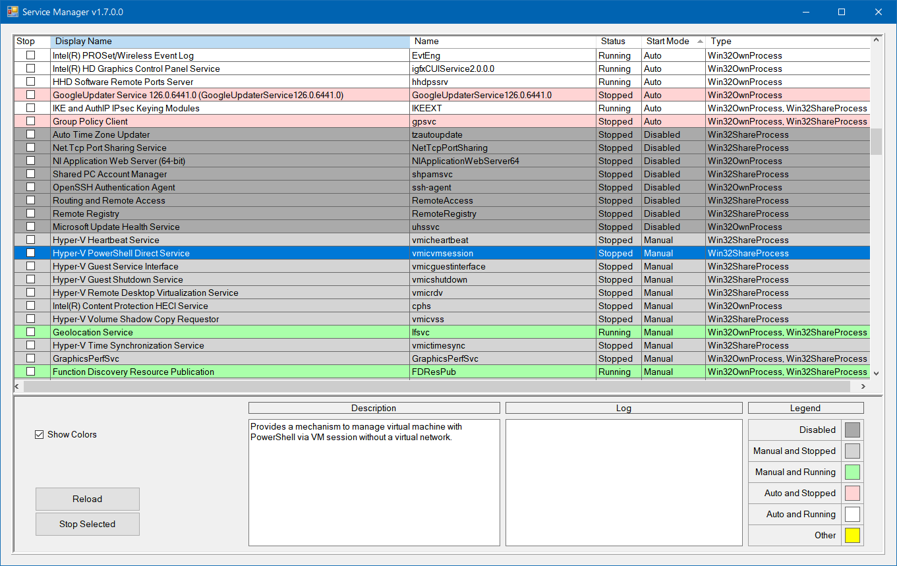

# Service Manager (Windows)

### A Windows Service Manager.

A Windows Service Manager app very mutch like the Windows built in Service Manager but with less options and slower... The main difference is that I added colors to indicate the running state of the service.

I wrote this app while learining and practicing C# and WinForms.

The app is a WinForms application written in C# .NET.

